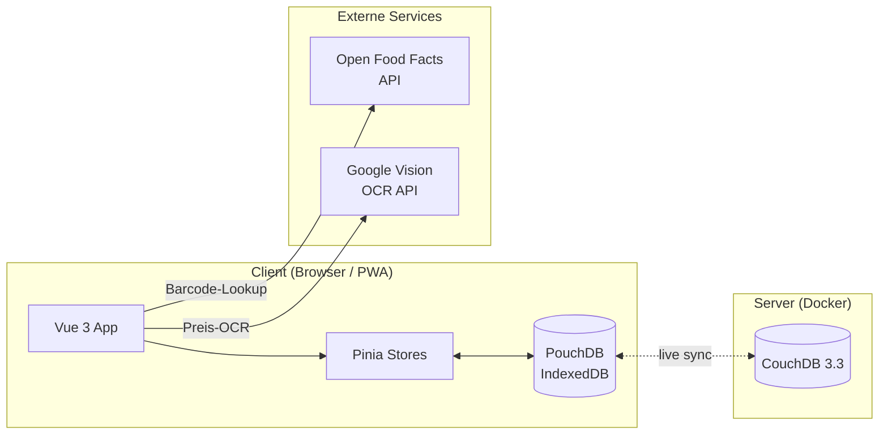
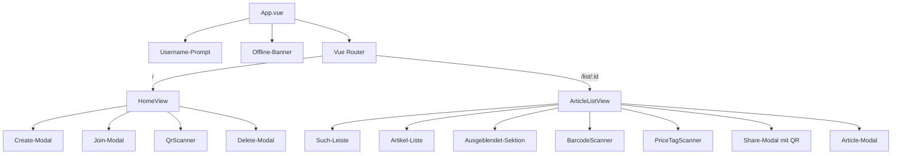
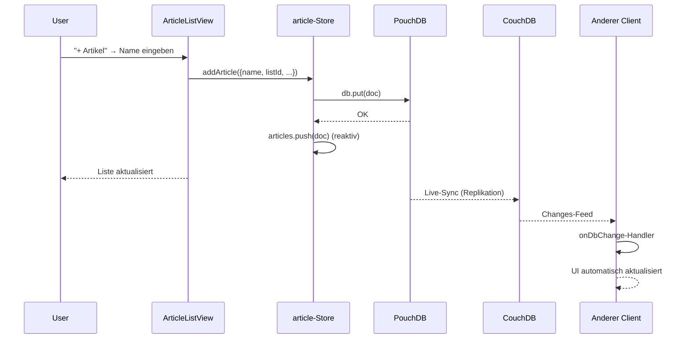
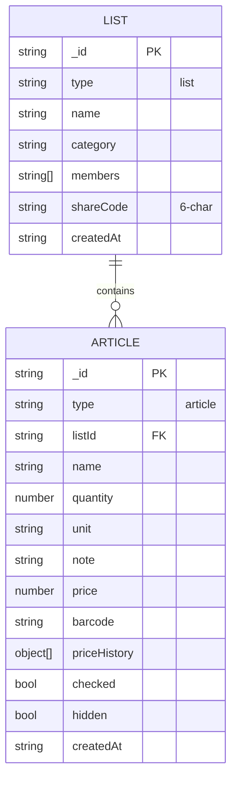

# Architektur

## Systemübersicht



## Designentscheidung: Kein Backend

Die App besitzt **keinen eigenen Backend-Server**. Der Browser synchronisiert direkt mit CouchDB.

**Warum?**
- CouchDB bietet von Haus aus HTTP/REST-Zugriff, Authentifizierung, CORS, Konfliktlösung
- PouchDB <-> CouchDB ist ein **erprobtes Replikationsprotokoll**
- Weniger Code, weniger Fehlerquellen, bessere Offline-Eigenschaften
- Entspricht dem **Offline-First**-Prinzip (task.md-Anforderung)

**Nachteile, die akzeptiert werden:**
- Keine serverseitige Business-Logik (z.B. keine Mail-Benachrichtigungen)
- Datenvalidierung nur clientseitig (für ein Schulprojekt okay)
- CouchDB-Credentials im Frontend-Bundle (kein Login-System)

## Komponenten-Hierarchie



## Pinia Stores

Alle Stores in `frontend/src/stores/`:

| Store | Verantwortung | Persistenz |
|---|---|---|
| `shoppingList.js` | Listen-CRUD, Join/Leave, Live-Sync | PouchDB |
| `article.js` | Artikel-CRUD, Hide/Restore, Suche, Preis-Historie | PouchDB |
| `theme.js` | Dark Mode Toggle | localStorage |
| `onlineStatus.js` | `navigator.onLine`-Wrapper | — |

**Konvention:** Stores sind im **Options-API-Style** geschrieben (außer `theme.js`, der Setup-Syntax nutzt — historisch gewachsen).

## Datenfluss (Beispiel: Artikel hinzufügen)



## Live-Sync mit `onDbChange`

In `db/index.js`:
```js
db.changes({ since: 'now', live: true, include_docs: true })
  .on('change', (change) => callbacks.forEach(cb => cb(change)))
```

Stores registrieren sich mit `onDbChange(handler)` und reagieren auf:
- Neue Dokumente (von anderen Clients)
- Updates (z.B. `checked` umgestellt)
- Deletes (`_deleted: true`)

Damit ist die UI **ohne Polling** reaktiv.

## Routing

```
/                → HomeView   (Listen-Übersicht)
/list/:id        → ArticleListView   (einzelne Liste)
```

Keine geschützten Routen — der Username-Prompt in `App.vue` wirkt als Gatekeeper.

## State-Initialisierung

1. `App.vue` onMount → prüft `hasUsername()`
2. Wenn ja → `seed.js` läuft (nur beim allerersten Start, sonst Skip)
3. Stores laden Daten aus PouchDB via `allDocs`
4. Changes-Feed wird gestartet → Live-Sync aktiv
5. CouchDB-Sync: `PouchDB.sync(local, remote, { live: true, retry: true })`

## Diagramm: Komplette Datenhaltung



Details → [Datenmodell-und-Sync](Datenmodell-und-Sync)
