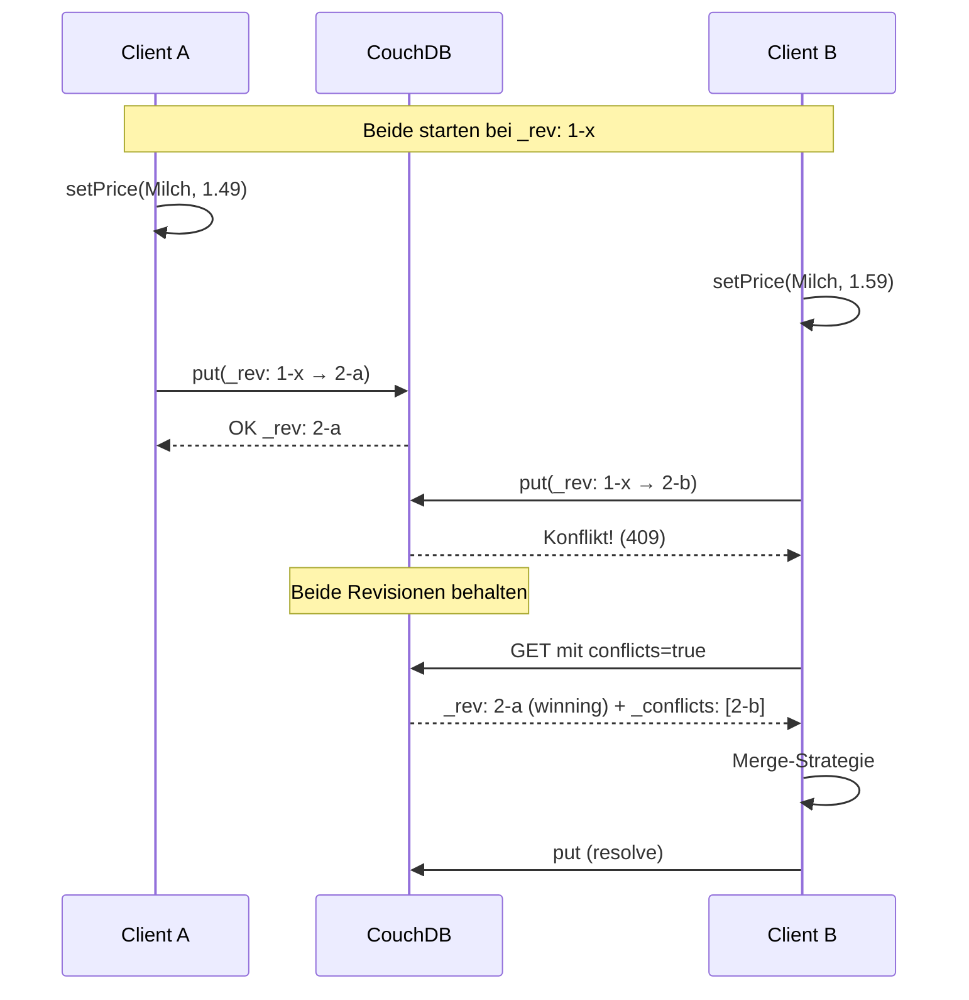

# Datenmodell und Synchronisation

## Dokument-Schemas

PouchDB und CouchDB sind **schemalos** (JSON-Dokumente). Unsere App verwendet zwei Dokument-Typen, unterschieden über das `type`-Feld.

### List-Dokument

```json
{
  "_id": "1712345678901",
  "_rev": "3-a1b2c3...",
  "type": "list",
  "name": "Wocheneinkauf",
  "category": "Lebensmittel",
  "members": ["Max#a1b2", "Lisa#c3d4"],
  "shareCode": "A3X9K2",
  "createdAt": "2026-04-16T10:30:00.000Z"
}
```

### Article-Dokument

```json
{
  "_id": "1712345679001",
  "_rev": "5-f6e7d8...",
  "type": "article",
  "listId": "1712345678901",
  "name": "Milch",
  "quantity": 2,
  "unit": "Liter",
  "note": "Bio",
  "price": 1.49,
  "barcode": "1234567890123",
  "priceHistory": [
    { "price": 1.29, "setAt": "2026-03-01T10:00:00.000Z" },
    { "price": 1.49, "setAt": "2026-04-10T09:15:00.000Z" }
  ],
  "checked": false,
  "hidden": false,
  "createdAt": "2026-04-16T10:30:01.000Z"
}
```

## Design-Entscheidungen

### Warum Timestamps als `_id`?

```js
const id = Date.now().toString()
```

**Vorteile:**
- Kollisionswahrscheinlichkeit innerhalb desselben Clients ist ~0 (Millisekunden-Genauigkeit)
- Natürlich sortierbar (chronologisch) — unterstützt die User Story "chronologisches Anzeigen"
- Einfacher als UUIDs, kürzer als CouchDB-generierte IDs

**Risiko:**
- Zwei Clients könnten gleichzeitig dieselbe Millisekunde treffen → CouchDB-Konflikt
- In der Praxis extrem unwahrscheinlich, bei Konflikt greift MVCC (siehe unten)

### Warum `allDocs` statt Mango-Queries?

```js
db.allDocs({ include_docs: true })
  .then(res => res.rows.filter(r => r.doc.type === 'list'))
```

- Kein Index-Setup nötig
- Bei wenigen hundert Dokumenten pro User performant genug
- Client-Filterung ist trivial zu debuggen
- Mango-Queries würden bei Index-Mismatches zwischen PouchDB und CouchDB Probleme machen

## Synchronisation (PouchDB ↔ CouchDB)

### Setup

```js
PouchDB.sync(localDb, remoteDbUrl, {
  live: true,
  retry: true
})
```

- **`live: true`**: kontinuierlicher Sync, nicht ein einmaliger Snapshot
- **`retry: true`**: bei Verbindungsabbrüchen automatisch retry mit exponential backoff
- Bidirektional: Änderungen fließen in beide Richtungen

### Replikationsprotokoll (Kurz)

1. Source fragt Target: "Was ist dein letzter bekannter Stand?" (checkpoint)
2. Source sendet `_changes` seit diesem checkpoint
3. Target fragt per `_bulk_get` die fehlenden Dokumente ab
4. Target schreibt via `_bulk_docs`
5. Neuer checkpoint wird gespeichert

Das Ganze läuft sowohl local→remote als auch remote→local parallel.

## Konfliktlösung

CouchDB verwendet **MVCC (Multi-Version Concurrency Control)**: jedes Dokument hat ein `_rev`-Feld, das die Version identifiziert.

### Szenario: Zwei Clients bearbeiten gleichzeitig



### Unsere Strategie: "Last Write Wins" (implizit)

- CouchDB wählt automatisch einen Winner (deterministisch, basierend auf `_rev`-String)
- Der Looser wird als Konflikt gespeichert, ist aber abrufbar
- Wir zeigen aktuell keinen **expliziten Konflikt-Indikator** in der UI (Story #24 ist für Benachrichtigungen geplant)

**Warum akzeptabel?**
- Die meisten Änderungen an Listen/Artikeln sind **kommutativ** (Artikel hinzufügen: beide landen drin)
- Konflikte treten praktisch nur beim gleichzeitigen Bearbeiten eines einzelnen Feldes auf (z.B. Preis)
- Für ein Schulprojekt mit wenigen Nutzern pro Liste ausreichend

### Erweiterungsmöglichkeit

Für produktive Nutzung würden wir **CRDTs** oder ein operationsbasiertes Schema (z.B. Artikel-Log statt Artikel-Objekt) einsetzen. Aktuell out-of-scope.

## Share-Codes

### Generierung (`db/index.js`)

```js
function generateShareCode() {
  const chars = 'ABCDEFGHJKLMNPQRSTUVWXYZ23456789'  // ohne O/0/I/1
  let code = ''
  for (let i = 0; i < 6; i++) {
    code += chars[Math.floor(Math.random() * chars.length)]
  }
  return code
}
```

**Designentscheidungen:**
- **6 Zeichen:** balance zwischen Kürze und Kollisionswahrscheinlichkeit
  - 32^6 = ~1 Milliarde Kombinationen → ausreichend für Schulprojekt
- **Keine ähnlichen Zeichen** (O/0, I/1): erleichtert manuelles Abtippen
- **Keine Kleinbuchstaben:** vermeidet Case-Sensitivity-Verwirrung

### Lookup

```js
// beim Join:
db.allDocs({ include_docs: true })
  .then(res => res.rows.find(r => r.doc.shareCode === code))
```

Kein Index nötig — bei typischer Nutzung (<1000 Listen) in ms durchgesucht.

## Changes-Feed

Live-Reaktivität über einen zentralen Feed in `db/index.js`:

```js
db.changes({ since: 'now', live: true, include_docs: true })
  .on('change', (change) => {
    callbacks.forEach(cb => cb(change))
  })
```

Jeder Store registriert sich:

```js
onDbChange((change) => {
  if (change.doc?.type === 'list') {
    // Listen-Array updaten
  }
})
```

**Vorteile:**
- Eine einzige Änderungsquelle (single source of truth)
- Keine Prop-Drilling oder Event-Bus nötig
- Automatische UI-Updates bei Remote-Änderungen

## Offline-Verhalten

1. Benutzer geht offline (kein Internet)
2. `navigator.onLine` → `false`, Banner erscheint
3. Alle CRUD-Operationen schreiben direkt in PouchDB (lokal)
4. UI reagiert sofort (optimistic updates über reaktive Stores)
5. Sync ist pausiert, versucht aber im Hintergrund retry
6. Internet kommt zurück → `retry: true` erkennt das
7. Queue wird automatisch abgearbeitet, Konflikte (falls vorhanden) resolved
8. Banner verschwindet
