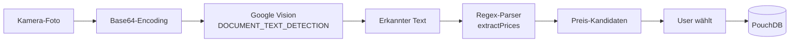

# Features im Detail

Tech-Deep-Dive zu den wichtigsten Features.

## Barcode-Scanner

**Datei:** `frontend/src/views/BarcodeScanner.vue`
**Bibliothek:** `@zxing/browser`
**Datenquelle:** [Open Food Facts API](https://world.openfoodfacts.org/data)

### Ablauf

1. User öffnet Scanner aus `ArticleListView`
2. `getUserMedia({ video: { facingMode: 'environment' } })` holt Kamera
3. ZXing-Decoder läuft auf dem Video-Stream
4. Erkennung → Barcode-String (z.B. EAN-13)
5. HTTP-Request: `GET https://world.openfoodfacts.org/api/v2/product/<barcode>.json`
6. Produktname, Marke, Nährwerte extrahieren
7. Artikel-Modal prefilled öffnen
8. User bestätigt → Artikel gespeichert

### Nährwerte (Story #32)

Aus der API-Response angezeigt:
- `energy-kcal_100g` → kcal
- `proteins_100g` → Protein
- `fat_100g` → Fett
- `carbohydrates_100g` → Kohlenhydrate

### Einschränkungen

- **HTTPS erforderlich** (Browser-Sicherheitsregel für Kamera-Zugriff)
  - Ausnahme: `localhost` im Dev
- Open Food Facts ist eine Community-DB → nicht alle Produkte vorhanden
- Fallback: User kann Namen manuell eingeben

## Preisschild-Scanner (OCR)

**Datei:** `frontend/src/views/PriceTagScanner.vue`
**Utility:** `frontend/src/utils/ocrPrice.js`
**Bibliothek:** Google Vision API (via HTTP)

### Pipeline



### Regex-Parser (`extractPrices`)

Erkennt typische Preisformate:
- `1,49` / `1.49` / `1,49 €` / `€ 1,49`
- `0,99` / `10,00`
- Ignoriert offensichtliche Non-Preise (Datum, PLZ, Mengenangaben)

Multiple Kandidaten werden an den User zurückgegeben (Ranking nach Plausibilität: größte Schrift auf Preisschild = wahrscheinlichster Preis).

### Preis-Historie

```js
article.priceHistory.push({
  price: article.price,   // alter Preis
  setAt: article.updatedAt
})
article.price = newPrice
```

So kann der Nutzer Preisänderungen über Zeit nachvollziehen.

### Kosten & Konfiguration

- Google Vision: erste 1000 Requests/Monat kostenlos
- API-Key in `.env`: `VITE_GOOGLE_VISION_API_KEY=...`
- Ohne Key: Feature ist deaktiviert (grauer Button), App funktioniert trotzdem

## QR-Code Sharing (Story #35)

**Feature-Branch:** `feature/share-code-qr`

### Anzeige (Share-Modal)

- `qrcode` NPM-Package rendert den Share-Code als PNG/Canvas
- URL-Format: Share-Code direkt (keine URL), damit der QR auch offline/domain-unabhängig funktioniert
- Alternative: URL-basierter QR (z.B. `https://cocojambo.app/join/A3X9K2`) → aktuell verworfen wegen Domain-Abhängigkeit

### Scan (`QrScanner.vue`)

- Wiederverwendet ZXing (wie Barcode-Scanner, aber QR-Format)
- Erkannter Code wird direkt in `joinList(code)` eingespeist
- Fallback: manuelles Eingabefeld bleibt sichtbar

## PWA (Progressive Web App)

### vite-plugin-pwa

`vite.config.js`:
```js
VitePWA({
  registerType: 'autoUpdate',
  manifest: { ... },
  workbox: { ... }
})
```

### Manifest

- App-Name, Farben, Icons (verschiedene Größen), `start_url`, `display: standalone`
- Ergebnis: App-Icon auf Home-Screen, Fullscreen-Betrieb ohne Browser-UI

### Service Worker

- **Precaching:** App-Shell (HTML, JS, CSS) beim ersten Besuch
- **Runtime-Caching:**
  - Google Fonts: CacheFirst
  - Open Food Facts: NetworkFirst mit 1 Tag Cache
- **`registerType: 'autoUpdate'`:** neue Version wird automatisch nachgeladen
  - User muss einmal neu laden, damit der neue Worker aktiv wird

### Offline-Fähigkeit

- App-Shell ist offline verfügbar
- PouchDB (IndexedDB) hält Daten auch ohne Netz
- Einzige Netzwerk-Requiremnt: Sync zur CouchDB (darf fehlschlagen)

## Dark Mode

**Store:** `frontend/src/stores/theme.js`
**Setup:** TailwindCSS v4 custom variant

### CSS (`main.css`)

```css
@import "tailwindcss";
@custom-variant dark (&:where(.dark, .dark *));
```

### Store

```js
const isDark = ref(localStorage.theme === 'dark')

watchEffect(() => {
  document.documentElement.classList.toggle('dark', isDark.value)
  localStorage.theme = isDark.value ? 'dark' : 'light'
})
```

### Verwendung im Template

```html
<div class="bg-white dark:bg-gray-800 text-gray-900 dark:text-gray-100">
```

Tailwind generiert beide Klassen. Die `dark:`-Variante greift nur, wenn `<html>` die Klasse `dark` hat.

## Real-Time-Suche

**Store:** `article.js` → `searchArticles(query)`

Drei Kategorien im Ergebnis:

1. **In aktueller Liste:** `article.listId === currentListId`
2. **In anderen Listen:** `article.listId !== currentListId`
3. **Historisch:** Artikel mit `hidden: true`

Kein Debounce nötig — PouchDB-Queries sind lokal und schnell. Bei sehr großen Datensätzen wäre Debouncing sinnvoll.

## Online-Status-Banner

**Store:** `onlineStatus.js`

```js
window.addEventListener('online', () => isOnline.value = true)
window.addEventListener('offline', () => isOnline.value = false)
```

**Einschränkung:** `navigator.onLine` ist nicht 100% zuverlässig (z.B. WLAN verbunden aber kein Internet). Für ein Schulprojekt ausreichend — für Produktion wäre ein Heartbeat-Check gegen CouchDB besser.

## CSV-Export (Story #30)

- User klickt "Exportieren" in einer Liste
- Artikel werden in CSV-Format gewandelt:
  ```csv
  Name,Menge,Einheit,Preis,Notiz
  Milch,2,Liter,1.49,Bio
  ```
- Download via `Blob` + `URL.createObjectURL`
- Öffenbar in Excel, LibreOffice, Google Sheets
